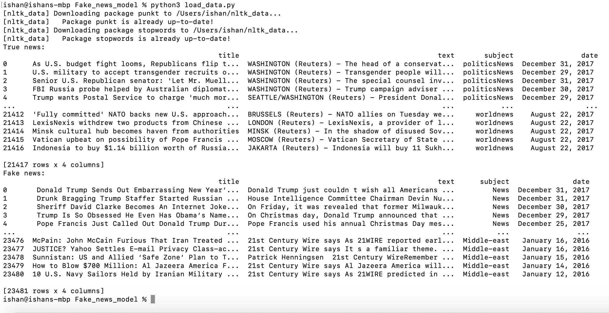
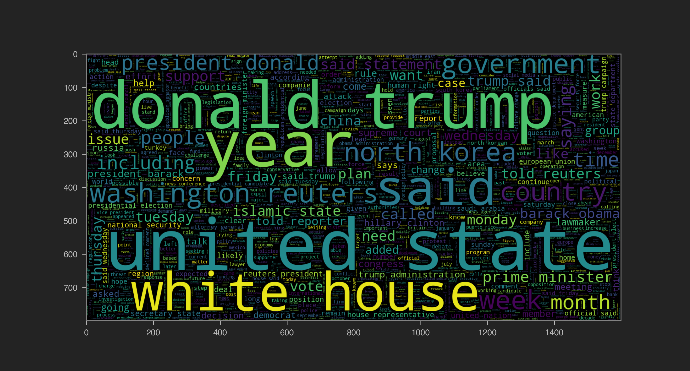

ME:HI,Welcome to My new project Fake news detector

You: OH! Interesting would you like to tell me about this project?

Me: Sure, nowadays internet connected whole world with each other and you can get news from any city of world but it also increased risk of fake news and rumour so this machine learning model detects which new is fake and which is real one

You:Hmm, that's pretty useful so which machine learning model it uses?

Me: it uses recurrence neural network particularly LSTM(Long short term memory)

You: how it is different from others?

Me:it is pretty special model. It has its own memory which remember things for some amount of time 

You: what special about memory ?

Me: Model learns from it output so it is like this as per output of problem weights of Input changes

You: in Simple words?

Me: important of input on output changes using output so the model improves itself using output

You: for how long?

Me: until we get our desired accuracy of model Performance 

You: that's so cool its like human brain which learn things on its own

Me: yea that's why it is machine learning to make machine learn things 

You: can you show me some cool stuff of your project?

Me: Sure why not !

Me: let me show some details about this project

see we have 21417 true news and 23481 fake news kinda fascinating right?

You: woah -_- that is so much of data 

Me:let's categorize our data

See we have categorized our data in news count by topic of news

You:There are so many political news

Me: Yes, there are so many things going on in politics that's why we can counter so many fake news in this topic

See this

You: interesting looks like painting

Me: yea some people use wordcloud as painting but these two graphs represent most frequent words occur in true and fake news

You:Oh so Donald trump is common one haha poor trump

Me:
Our model accuracy around 96% so I think it is pretty right?

You:what? It is super cool like it will predict right 96 times out of 100 woah.so it is end now?

Me: Yea I think so  thank you for listening

You:oh that's sad 

Me: dont worry we would meet soon in my next project till then good bye take care

